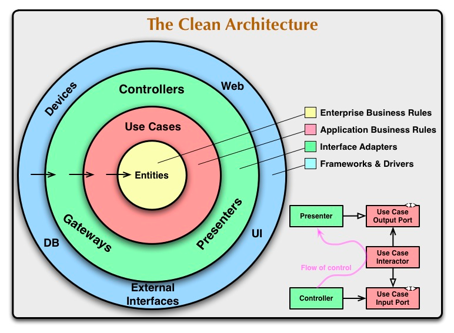

# redis-generic-crud

## Description

Generic CRUD for a single entity type containing an ID and map of atributes.

## Clean Architecture (by uncle bob)

Source: https://blog.cleancoder.com/uncle-bob/2012/08/13/the-clean-architecture.html

Architecture is the shape of a system. Architecture supports the behavior of the system while keeping its flexibility to change. The responsibility for this flexibility is upon the architect and the developers of the system.
**Architecture is about intent**

Como se ven sus proyecto? que les dice? como los organizan?

###Architecture should make software:

- Independent of Frameworks. The architecture does not depend on the existence of some library of feature laden software. This allows you to use 
such frameworks as tools, rather than having to cram your system into their limited constraints.
- Testable. The business rules can be tested without the UI, Database, Web Server, or any other external element.
- Independent of UI. The UI can change easily, without changing the rest of the system. A Web UI could be replaced with a console UI, for example, 
  without changing the business rules.
- Independent of Database. You can swap out Oracle or SQL Server, for Mongo, BigTable, CouchDB, or something else. Your business rules are not 
  bound to the database.
- Independent of any external agency. In fact your business rules simply don’t know anything at all about the outside world.

###The Dependency Rule
The concentric circles represent different areas of software. In general, the further in you go, the higher level the software becomes. The outer circles are mechanisms. The inner circles are policies.

The overriding rule that makes this architecture work is The Dependency Rule. This rule says that source code dependencies can only point inwards.

###Entities
Entities encapsulate Enterprise wide business rules. An entity can be an object with methods, or it can be a set of data structures and functions. It doesn’t matter so long as the entities could be used by many different applications in the enterprise.

###Use Cases
The software in this layer contains application specific business rules. It encapsulates and implements all of the use cases of the system. These use cases orchestrate the flow of data to and from the entities, and direct those entities to use their enterprise wide business rules to achieve the goals of the use case.

###Interface Adapters
The software in this layer is a set of adapters that convert data from the format most convenient for the use cases and entities, to the format most convenient for some external agency such as the Database or the Web. It is this layer, for example, that will wholly contain the MVC architecture of a GUI. The Presenters, Views, and Controllers all belong in here

###Frameworks and Drivers.
The outermost layer is generally composed of frameworks and tools such as the Database, the Web Framework, etc. Generally you don’t write much code in this layer other than glue code that communicates to the next circle inwards.

###More
Only Four Circles?
No, the circles are schematic. However, The Dependency Rule always applies. Source code dependencies always point inwards

Crossing boundaries.
We usually resolve this apparent contradiction by using the Dependency Inversion Principle.

What data crosses the boundaries.
Typically the data that crosses the boundaries is simple data structures. You can use basic structs or simple Data Transfer objects if you like